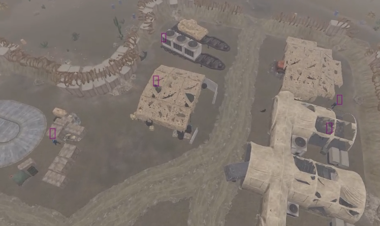

### 🗃️ Archived Project – This repository is no longer maintained.

---

# Rust Extra Sensory Perception Overlay

This project showcases a graphical extra sensory perception (ESP)-style overlay for the game **Rust**, developed as a technical deep dive into memory reading, Windows internals, and overlay rendering. It was built purely as a learning exercise and is designed to work only in **private server environments**.

**The goal:** hook into the game, track in-world entities like players and scientists, and render them live on screen — all without touching third-party libraries or cheat frameworks.

---

## Table of Contents

- [Project Overview](#rust-extra-sensory-perception-overlay)
- [⚠️ Disclaimer](#disclaimer)
- [Features](#features)
- [Screenshot](#screenshot)
- [Development Breakdown](#development-breakdown)
- [Technical Notes](#technical-notes)
- [Requirements](#requirements)
- [🚀 Build & Run](#build--run)
- [📄 License](#license)
- [Possible Improvements](#possible-improvements)
- [📝 Final Thoughts](#final-thoughts)

---

<h2 id="disclaimer">⚠️ Disclaimer</h2>

- This mod was tested **only** in private environments with anti-cheat disabled.
- It does **not** attempt to bypass EAC or any other protection mechanisms.
- Using this on public servers **will result in game bans**, or worse.
- This project is for educational purposes only.

I take no responsibility for misuse. If you experiment with this, do it responsibly and legally.

---

<h2 id="features">Features</h2>

- **Memory scanning** using Cheat Engine to find entity position instructions
- **Assembly injection** to capture and log base addresses of live entities
- **Windows API hooks** to create an external overlay window using `Win32` and `GDI+`
- **Double-buffered shared memory** to sync data between game hook and overlay safely
- **Custom projection pipeline** to map 3D positions to 2D screen space (approximate)

---

<h2 id="screenshot">Screenshot</h2>

Here’s a look at the overlay in action, captured on a private Rust server:

The purple rectangles are rendered by this app, and everything else you see belongs to the game.

While the boxes aren’t perfectly precise, they generally indicate where nearby scientists are located. Some boxes don’t align exactly over the scientists due to my hand-designed projection math. 

As for boxes that seem to point to empty space, those scientists are simply hidden behind objects in the scene. The app actually uses post-occlusion culling data (it can't "see" behind objects), but in this instance, that didn’t have much visual impact — likely a quirk of Rust’s rendering pipeline.

Since this app won’t function with the current version of Rust, I’ve also included several other screenshots in the `screenshots/` folder. Feel free to check them out!

---

<h2 id="development-breakdown">Development Breakdown</h2>

<h3 id="reverse-engineering">1. Reverse Engineering</h3>
- Used **Cheat Engine** to identify instructions accessing positional data for players.
- Located a post-culling instruction that provided visible entity positions.
- This step took ~12 hours of scanning and tracing memory reads. Rust *really* did not make my life easy here. 😅

<h3 id="cpp-hooking">2. C++ Hooking</h3>
- Wrote a Windows application, leveraging pieces from a prior modding project.
- Located the relevant instruction in `GameAssembly.dll` using static offsets from module base.
- Injected **assembly bytecode** to intercept that instruction and log addresses to a set.

<h3 id="data-sharing">3. Data Sharing</h3>
- Built a **double-buffered memory structure** that gets injected into the game process. For more details, check out `asm/README.md`
- Parsed the entity base addresses into structured 3D positional data ready for rendering.

<h3 id="overlay-rendering">4. Overlay Rendering</h3>
- Used `GDI+` and `Win32` to draw a transparent overlay on top of the game window.
- Approximate projection using a perspective matrix. Not 1:1 with Unity’s, but serviceable.
- Rendered bounding boxes in real time based on entity positions.

---

<h2 id="technical-notes">Technical Notes</h2>

### Known Limitations
- **No occlusion or terrain awareness** — only visible entities are detected. (as was shown in the screenshot, Rust is also a bit inconsistent about what counts as "occlusion.")
- **Projection matrix was hand-tuned** — it’s a rough approximation of Unity's internal camera system, but not accurate.
- **Breaks after game updates** — Rust updates monthly, and this injector relies on fixed offsets. As such, this version is currently *incompatible* with the latest build of the game.

---

<h2 id="requirements">Requirements</h2>

- Windows OS (tested on Windows 10)
- C++17-compatible compiler (uses `g++`)
- Cheat Engine (for address discovery)
- Private server or offline Rust client (EAC must be disabled)

---

<h2 id="build--run">🚀 Build & Run</h2>

1. Clone the repository.
2. Build the executable with `build/BuildAll.bat`
3. Launch Rust in a private server or test environment.
4. Run the executable (`build/main.exe`)

---

<h2 id="license">📄 License</h2>

This project is licensed under the GNU General Public License v3.0.

You are free to use, modify, and distribute this software, as long as any derivative work is also shared under the same license.

SPDX-License-Identifier: GPL-3.0

<h3 id="ethical-use-notice">Ethical Use Notice</h3>

This project is for **educational purposes only** and must be used **only on private servers with anti-cheat disabled**.

I do **not** support or authorize use in public servers or to bypass anti-cheat software.  

**Using this in unauthorized environments is illegal, violates terms of service, and may lead to bans or legal action.**

You are solely responsible for how you use this software. I disclaim all liability for misuse.

---

<h2 id="possible-improvements">Possible Improvements</h2>

- Improve projection math to better match Unity’s coordinate system
- Add overlay UI for entity filtering, distances, and toggles
- Cache more entity data directly instead of just base addresses for performance
- Make the rendering cleaner and potentially add smoothing or interpolation

---

<h2 id="final-thoughts">📝 Final Thoughts</h2>

> This wasn’t originally meant to be a public or portfolio project, just something I built out of curiosity. But once I had the hook working and saw bounding boxes tracking in game entities... I felt I had to share it.  
> There’s a lot I’d clean up if I revisited this seriously — but as a technical proof of concept, I’m proud of it.  
> — Linden Sheehy
